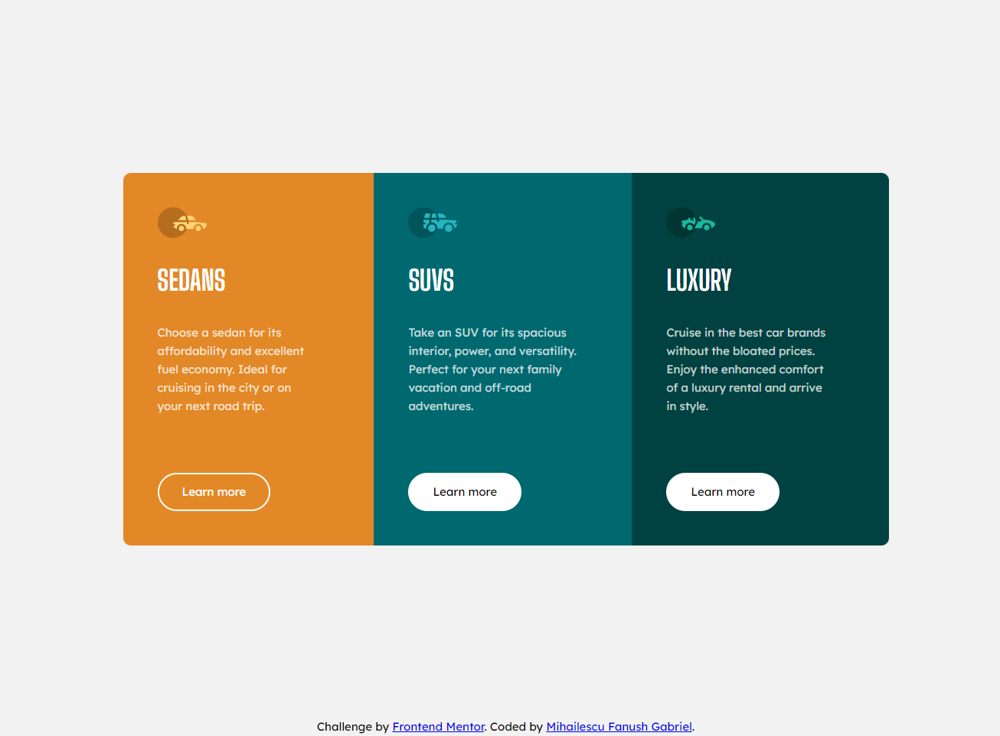
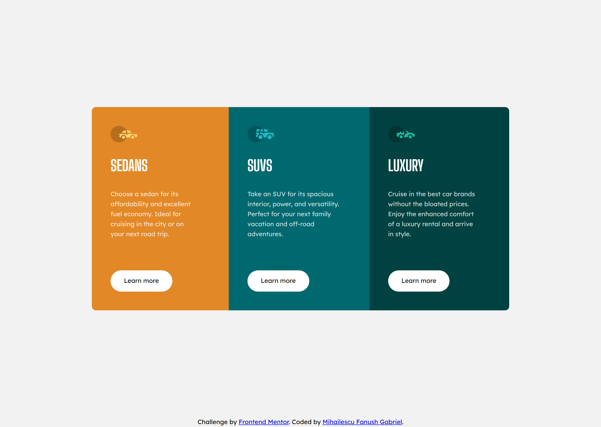
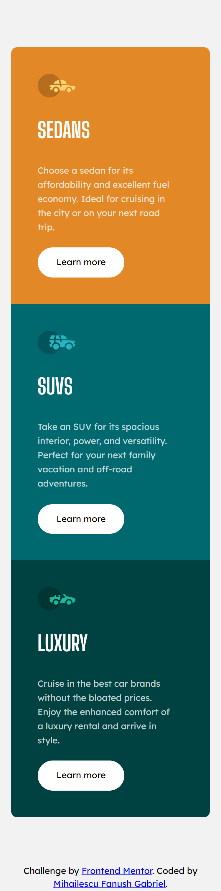

# Frontend Mentor - 3-column preview card component solution

This is a solution to the [3-column preview card component challenge on Frontend Mentor](https://www.frontendmentor.io/challenges/3column-preview-card-component-pH92eAR2-). Frontend Mentor challenges help you improve your coding skills by building realistic projects. 

## Table of contents

- [Overview](#overview)
  - [The challenge](#the-challenge)
  - [Screenshot](#screenshot)
  - [Links](#links)
  - [Built with](#built-with)
  - [What I learned](#what-i-learned)
  - [Continued development](#continued-development)
- [Author](#author)

### The challenge

Users should be able to:

- View the optimal layout depending on their device's screen size
- See hover states for interactive elements

### Screenshot

### Links

- Solution URL: [Github Repository](https://github.com/Fanushhh/3-column-preview-card-component-main)
- Live Site URL: [Live site](https://fanushhh.github.io/3-column-preview-card-component-main/)

### Built with

- Semantic HTML5 markup
- SCSS
- Flexbox
- Mobile-first workflow

### What I learned

For this section I wanted to challenge myself and I started using SCSS to stylize some things, custom variables to hold the fonts, colors and a mixin for the media query

### Continued development

For the future I plan on studying more about SCSS and how can I implement it better in my mision to conquer responsiveness.

## Author

- Website - [Mihailescu Fanush Gabriel](https://fanushhh.github.io/Stylized-Website/)
- Frontend Mentor - [@Fanushhh](https://www.frontendmentor.io/profile/Fanushhh)

